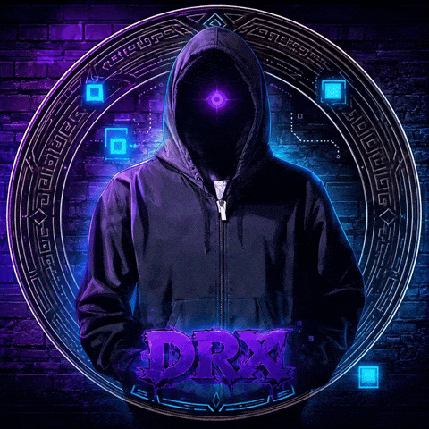

<div align="center">



<br>

# DarkRX

### Cybersecurity · Systems · Software

*Building tools. Breaking assumptions. Learning relentlessly.*

<br>

<a href="https://tryhackme.com/p/DarkRX01">
  
</a>
<a href="https://medium.com/@darkrx001">
  
</a>
<a href="https://ko-fi.com/darkrx">
  
</a>

</div>

<br>

## `$ whoami`

I'm **DarkRX**, a cybersecurity student and developer interested in understanding what happens beneath the surface of the systems we use.

I spend most of my time around **security, networking, Linux, and systems programming** — learning by building things, testing them against reality, and figuring out where my assumptions were wrong.

I don't just want to know how to run a tool.

I want to understand **why it works**.

<br>

## `$ interests`

<table>
<tr>
<td width="50%" valign="top">

### Security

`Network Security`  
`Web Security`  
`Security Research`  
`Protocol Analysis`  
`Offensive Security`  
`Defensive Security`

</td>
<td width="50%" valign="top">

### Engineering

`Rust`  
`Linux`  
`Systems Programming`  
`Networking`  
`Performance`  
`CLI Tooling`

</td>
</tr>
</table>

<br>

## `$ stack`

<div align="center">


</div>

<br>

## `$ current_project`

<table>
<tr>
<td width="100%" valign="top">

### RXScan — Raw Excess Scan

**Fast, bounded reconnaissance in Rust.**

RXScan is a native reconnaissance scanner I'm building while exploring network discovery, protocols, service identification, performance, and security engineering.

What started as a small experiment has become the project where I put a lot of what I'm learning into practice.

`Rust` · `TCP/UDP` · `HTTP` · `TLS` · `DNS` · `Systems`

<br>

<a href="https://github.com/DarkRX1/RXScan">
  
</a>

</td>
</tr>
</table>

<br>

## `$ fieldnotes`

Not everything I learn turns into a repository.

I use my fieldnotes to document **labs, research, experiments, mistakes, discoveries, and things worth remembering**.

<div align="center">

<a href="https://tryhackme.com/p/DarkRX01">
  
</a>
&nbsp;
<a href="https://medium.com/@darkrx001">
  
</a>

</div>

<br>

## `$ status`

```text
[+] learning       security + systems
[+] building       RXScan
[+] environment    Linux
[+] language       Rust
[+] mindset        build -> test -> measure -> improve
